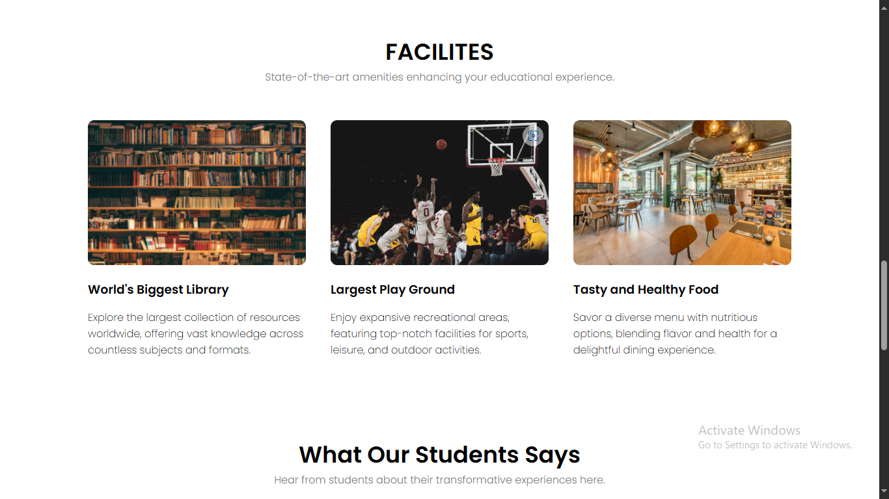

# CampusOpedia

CampusOpedia is a comprehensive frontend website designed to provide detailed information about universities and colleges. The platform is an invaluable resource for students, parents, and educators seeking insights into various educational institutions.

## Demo

To see the live demo [Click Here](https://1622vishal.github.io/CampusOpedia/)

## Table of Contents

- [Demo](#demo)
- [About the Project](#about-the-project)
- [Features](#features)
- [Technologies Used](#technologies-used)
- [Screenshots](#screenshots)
- [Contributing](#contributing)
- [Contact](#contact)

## About the Project

CampusOpedia aims to bridge the information gap between students and educational institutions by providing an accessible platform where users can explore a wealth of information about universities, including courses, facilities, campus life, and more.

## Features

- **University Information**: Detailed descriptions of universities, including their courses, library facilities, playgrounds, etc.
- **User-Friendly Interface**: A responsive design that works across all devices.
- **Search Functionality**: Search and filter universities based on various criteria.
- **Course Details**: Detailed descriptions of courses offered.
- **Interactive Campus Maps**: Visual representation of campus layouts.
- **Student Testimonials**: Reviews and testimonials from students.

## Technologies Used

- **[]()** : For content structuring.
- **[]()** : For styling and layout.
- **[]()** : For interactive features.
- **[]()** : For responsive design.
- **[]()** : For icons.

## Screenshots

### Homepage


### University Details Page


### Feedback Page


## Contributing

We welcome contributions to CampusOpedia! If you're interested in contributing, please follow these guidelines:

1. **Fork the repository** to your GitHub account.
2. **Clone your fork** to your local machine:
   ```bash
   git clone https://github.com/your-username/CampusOpedia.git

## Contact

If you have any questions, suggestions, or just want to connect, feel free to reach out:

- **[](mailto:vishalyadav82738@gmail.com)** 
- **[](https://www.linkedin.com/in/vishal-yadav-347275225/)**
- **[](https://github.com/1622vishal)**
- **[](https://leetcode.com/u/vishalyadav1622/)**
- **[](https://www.naukri.com/code360/profile/f9f808ea-e62e-455e-a72b-65035bdc4ea1)**
- **Portfolio**: []()

Feel free to reach out for any questions or collaboration opportunities!


